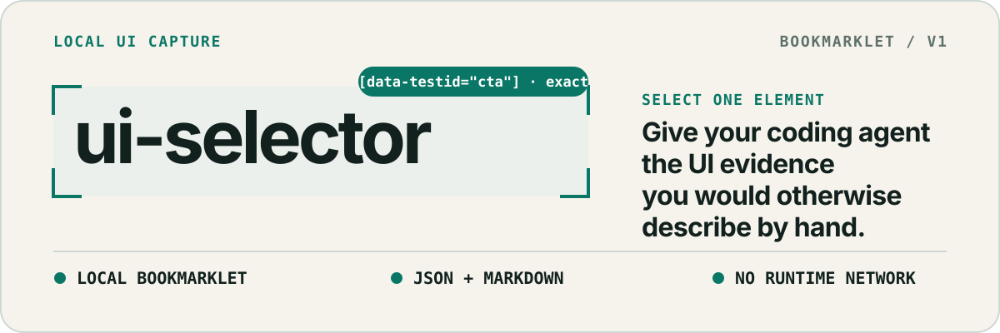
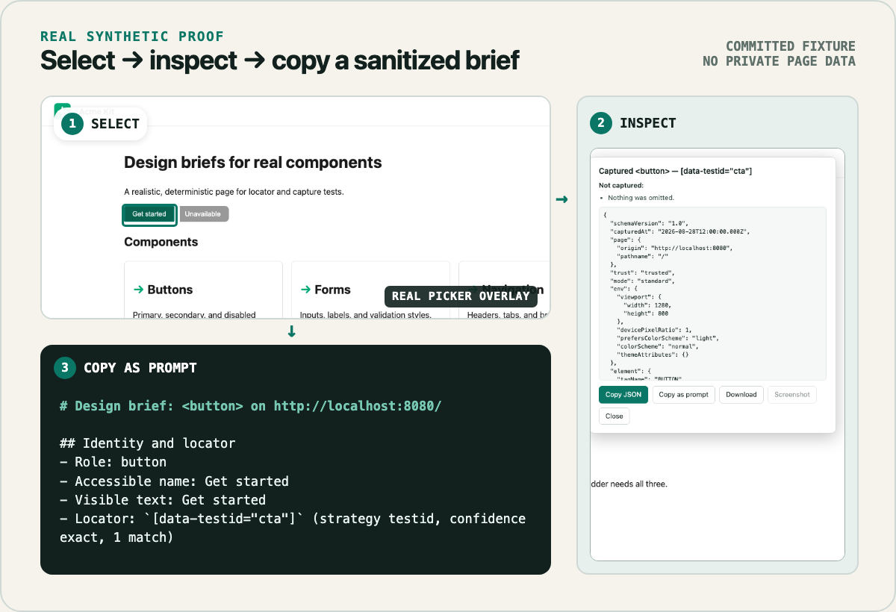
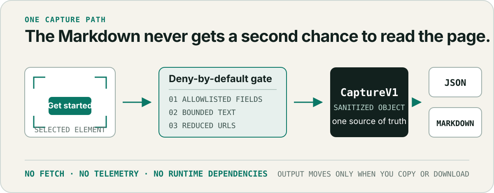

<p align="center">
  
</p>

<p align="center">
  <a href="https://github.com/ZH-L1N/ui-selector/actions/workflows/ci.yml"></a>
  <a href="./LICENSE"></a>
</p>

`ui-selector` is a source-built v1 bookmarklet for frontend developers who work with AI
coding agents. Select one element on a page, inspect exactly what was captured, then copy a
structured JSON object or prompt-ready Markdown brief.

There is no extension, server, telemetry, or runtime network request. The bookmarklet is
built on your machine, and a deny-by-default allowlist controls every field that can reach
the output.

<p align="center">
  
</p>

The proof above is generated from the committed offline
[`Acme Kit` fixture](./tests/fixtures/site/index.html), the real picker overlay, the real
capture panel, and the current `toMarkdown` output. It contains no private-site data.

## How it works

1. **Run locally.** Click the bookmarklet and choose whether to proceed on the current
   origin. Deep mode is available only for origins trusted at build time.
2. **Select one element.** The picker captures allowlisted identity, layout, style, state,
   and environment evidence. An optional screenshot requires a separate explicit click.
3. **Inspect before sharing.** The panel shows what will leave the page. Copy canonical JSON,
   copy prompt-ready Markdown, or download the JSON file.

<p align="center">
  
</p>

`CaptureV1` is the only data path. `toMarkdown(result: CaptureV1)` is a pure function of that
already-sanitized object and never reads the DOM, so Markdown inherits the same redaction
guarantees as JSON.

## Quick start

You need Node.js, npm, and Chrome or another Chromium browser.

1. Install the locked development dependencies:

   ```sh
   npm ci
   ```

2. Copy `selector.config.example.json` to the gitignored `selector.config.json`, then replace
   the example list with the origins you trust:

   ```json
   { "trustedOrigins": ["http://localhost", "http://127.0.0.1"] }
   ```

3. Build the self-contained bookmarklet:

   ```sh
   npm run build
   ```

4. Open `dist/install.html` in Chrome or Chromium and drag **ui-selector** to the bookmarks
   bar.
5. Open a page, click the bookmarklet, approve the trust prompt, select an element, and choose
   **Copy as prompt** or **Copy JSON**.

The bookmarklet has no update channel. After any source or trusted-origin change, rebuild it,
delete the old bookmark, and drag the newly generated link again. The install page prints the
build timestamp and embedded trusted origins so stale bookmarks are visible.

## What the brief contains

Every capture reports observed evidence and explains in-scope fields it could not capture:

- **Identity** — origin and pathname, tag, computed ARIA role, accessible name, allowlisted
  attributes, bounded visible text, and a self-verified locator.
- **Geometry and layout** — bounding rectangle, box model, parent flex/grid context, item
  properties, bounded ancestry, and stacking contexts.
- **Appearance** — a fixed computed-style table, referenced CSS custom properties,
  typography, and pseudo-elements.
- **Behavioral context** — matched interaction-state rules, active media conditions, theme,
  viewport, device pixel ratio, and webfont load status.
- **Omissions** — explicit reasons for in-scope fields that were restricted, inaccessible,
  unsupported, clipped, or intentionally excluded. Descendants, siblings, and ancestor
  backgrounds remain outside the current capture boundary.

| Mode         | Availability                                   | Additional evidence                                                                                                              |
| ------------ | ---------------------------------------------- | -------------------------------------------------------------------------------------------------------------------------------- |
| **Standard** | Every origin you explicitly allow for that run | Bounded identity, locator, geometry, layout, computed styles, tokens, type, states, environment, and omissions                   |
| **Deep**     | Trusted origins only; opt-in per run           | A sanitized subtree capped at 200 nodes / 20,000 characters, matched CSS rules, referenced keyframes, and reduced asset metadata |

Deep mode reports rules observed to match; it does not reimplement the CSS cascade. Layer
order, cross-layer `!important`, and `@scope` proximity are not resolved. `@container` and
`@scope` blocks are skipped with an omission.

The optional screenshot is a single `getDisplayMedia` frame cropped to the selected element
and painted into a local canvas. Screenshot bytes never enter `CaptureV1`, JSON, or Markdown.

For the complete schema, annotated Standard and Deep examples, and every omission reason,
see the [`CaptureV1` data contract](./docs/data-contract.md).

## Measured actionability

The first actionability run handed briefs for 12 fixture elements to independent coding
agents, asked them to rebuild each element without reading the source page, and judged the
result against the fixture.

| Sample                         |                    Result | What it means                                                    |
| ------------------------------ | ------------------------: | ---------------------------------------------------------------- |
| Text and control leaf elements |   Effectively pixel-exact | Geometry, tokens, and interaction states carried cleanly         |
| All 12 sampled elements        | **8 / 12 faithful (67%)** | Below the 80% target; the failures are concentrated, not diffuse |

The known high-impact gap is descendant-level capture. A selected container currently
describes its own box while visually important children are flattened into one text run, so a
card, section, or header may not be faithfully reconstructable. An image's artwork is also
unknowable without the separate screenshot path.

Read the full method, guesses, causes, and v1.1 priorities in
[`docs/actionability.md`](./docs/actionability.md).

## Safety boundaries

- No runtime network APIs, telemetry, storage writes, or hidden uploads exist in `src/`.
- URLs are restricted to `http`/`https` and reduced to origin plus pathname before emission.
- Cookies, storage values, form values, query strings, URL hashes, runtime framework state,
  `contenteditable` text, and password data are never captured.
- Unknown origins require a run-once confirmation and cannot use Deep mode. Trust promotion
  requires editing the local config and rebuilding.
- The standing redaction gate seeds every sensitive surface it knows about, captures every
  descendant in both modes and both text formats, and fails if any seed reaches the output.
- A bookmarklet still runs inside the page's JavaScript realm. It is not a sandbox against an
  actively hostile page.

Read the complete trust model, threat model, screenshot risks, shadow/frame boundaries, and
Claude artifact explanation in
[`docs/security-and-limitations.md`](./docs/security-and-limitations.md).

## Compatibility and limits

- **Chrome / Chromium:** supported v1 target; selection, capture, output, and tab screenshots.
- **Safari:** selection and text outputs work best-effort; its picker does not provide the
  tab surface required for a trustworthy crop, so screenshots end in
  `wrong-capture-surface`.
- **Firefox:** best-effort and currently untested.
- **Frames:** frame contents are not reachable from a top-document bookmarklet. Selecting a
  frame records `frame-content-unreachable`.
- **Shadow DOM:** open-shadow children can be selected through `composedPath`, but capture
  does not cross the shadow boundary in either direction.
- **Claude artifacts:** not supported. Their nested cross-origin frame topology requires an
  all-frames extension, which is a different product.

## Documentation

- [`docs/data-contract.md`](./docs/data-contract.md) — `CaptureV1`, examples, and omissions
- [`docs/security-and-limitations.md`](./docs/security-and-limitations.md) — trust and threat
  model
- [`docs/actionability.md`](./docs/actionability.md) — measured reconstruction fidelity
- [`docs/phase-0-manual-checks.md`](./docs/phase-0-manual-checks.md) — claims CI cannot make
- [`docs/superpowers/specs/ui-selector-mvp.md`](./docs/superpowers/specs/ui-selector-mvp.md) —
  product specification
- [`CLAUDE.md`](./CLAUDE.md) — architecture and contributor guidance

## Development

| Task                    | Command                                      |
| ----------------------- | -------------------------------------------- |
| Build bookmarklet       | `npm run build`                              |
| Unit tests              | `npm run test`                               |
| Browser tests           | `npm run test:e2e`                           |
| Lint                    | `npm run lint`                               |
| Format                  | `npm run format`                             |
| Typecheck               | `npm run typecheck`                          |
| Regenerate README proof | `node assets/readme/source/render-proof.mjs` |

MIT licensed. See [`LICENSE`](./LICENSE) and [`NOTICE`](./NOTICE) for prior-art credit.
